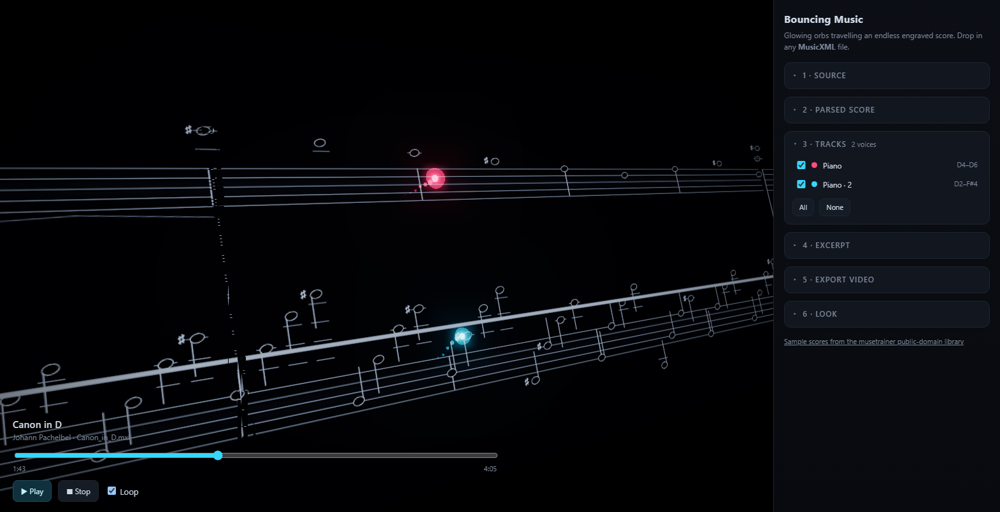

# Bouncing Music

Turn a MusicXML score into an endless dark music sheet with one glowing orb per
musical voice, hopping note to note in time with a synthesized performance. You
can drop in any score by URL or file, then play it, tweak the look, and export
the result as a video.



---

## What it does

1. **Reads a MusicXML score** — `.mxl` (zipped) or plain `.xml` / `.musicxml`,
   from a URL or a drag-and-drop.
2. **Parses it into a single event list** — parts, staves, voices, chords, ties,
   rests, grace notes, tuplets, tempo changes, dynamics, and hairpins.
3. **Engraves it** — staff lines, clefs, key and time signatures, note heads,
   stems, beams, ledger lines, barlines, dynamics and hairpins, drawn on canvas.
4. **Synthesizes the audio** with a small built-in synth (16 instrument
   families) in an `OfflineAudioContext`, shaped by the score's dynamics.
5. **Animates it** — each voice gets a lane and a comet-like orb that hops from
   note to note, lighting the staff as it lands, over a sheet that scrolls
   endlessly into fog.
6. **Exports a video** (MP4 where the browser supports it, WebM otherwise) with
   the audio muxed in.

Everything downstream of the parser reads the *same* event list, which is why the
orb lands on a note at exactly the moment you hear it — the sync is structural,
not tuned by hand.

## Running it

Requires Node 18+ (developed on Node 24).

```bash
npm install
npm run dev        # http://127.0.0.1:5173
```

Other scripts:

```bash
npm run build      # typecheck + production bundle into dist/
npm run preview    # serve the built bundle
npm run typecheck  # tsc --noEmit
```

## Using it

**Load a score.** Paste a URL into the *Source* box and press *Load* (or Enter),
drop a file anywhere on the window, or click one of the sample chips. The samples
come from the [musetrainer public-domain library](https://musetrainer.github.io/library/).
Cross-origin fetching works for any server that sends permissive CORS headers;
if a URL refuses, download the file and drop it in instead.

**Tracks.** A "track" here is one `(part, staff, voice)` — the thing that carries
a melody. Each active track gets its own ribbon with its own five-line staff,
even when two voices share a part in the source. If a piece has **4 or fewer**
voices they are all kept automatically. At **5 or more** the four busiest are
selected and the list is highlighted so you can choose your own; *All* and
*None* are there for quick changes.

**Excerpt.** Pieces under five minutes default to their full length; longer ones
default to the first minute. *Start* and *Length* re-render only the selected
window, and *Tempo* re-renders at a different playback rate.

Synthesizing is real DSP, so a long piece takes a moment: the four-minute Canon
renders in roughly 15–20 seconds, with a progress readout. Shorten the excerpt
if you want to start playing sooner.

**Look.** *Glow*, *Orb size*, *Trail*, *Lane gap* and *Camera* adjust the scene
live. Drag on the score to orbit, scroll to zoom.

**Export.** Pick a resolution, frame rate, and whether to export the current
excerpt or the whole piece, then press *Export MP4*. The audio can be downloaded
on its own as a WAV.

Export is deterministic: frame *n* renders score time `start + n/fps`, with no
dependence on wall-clock time, so the file is frame-exact and matches what the
preview shows. The preview and the exporter call the same `renderFrame(t)`.

The sidebar is a stack of collapsible cards. *Source* folds away once a score is
loaded and *Tracks* opens automatically, so the whole panel — including
*Export video* — stays on one screen; click any heading to expand it.

## How it is put together

```
src/
  core/        no DOM rendering, no three.js — pure score logic
    ingest.ts    fetch / file -> raw MusicXML text (unzips .mxl)
    parse.ts     MusicXML DOM -> ScoreModel (the event list)
    layout.ts    score time -> x, lanes, system breaking
    dynamics.ts  the shared dynamic curve (audio velocity + orb brightness)
    types.ts     the data model
  scene/
    engrave.ts   Canvas-2D engraver — notation becomes pixels
    ribbon.ts    pooled, recycled system planes = the endless sheet
    orbs.ts      comets, trails, note flashes, sparks
    world.ts     renderer, camera, bloom, and renderFrame(t)
  audio/
    instruments.ts  16 synth families + name/GM matching
    render.ts       chunked OfflineAudioContext render + WAV
    player.ts       live transport and clock
  export/video.ts   WebCodecs encode -> MP4/WebM via Mediabunny
  ui/app.ts         all the wiring
tools/cdp-check.mjs  headless smoke test (see below)
```

### Notes on a few decisions

**MusicXML carries no engraving geometry.** It describes *what* the notes are, not
where to draw them, so the layout engine and the engraver are part of this
project. A hand-written canvas engraver was chosen over a notation library to
match the stylised dark look and to avoid a large font/engraving dependency.

**A track is the animation unit.** Splitting voices onto separate staves
departs from real piano engraving on purpose — with two voices crammed onto one
staff the orbs would overlap and you could not tell them apart.

**Sheet space is y-up, and `stepY()` is the only place that decides it.** The
engrave canvas flips y again when it draws, and the orbs live directly in 3D.
Getting the sign wrong inverts every scale — the music plays descending while the
note *values* stay correct, which is why it can look plausible until you read it
musically. It is also invisible to a consistency check, because the orb lands on
its (inverted) note head either way. The checker asserts the sign directly: in
3D a higher pitch must give a higher `y`.

**Simultaneous notes are folded into chords, even without `<chord/>`.** The
format marks extra chord tones with `<chord/>`, and the parser merges those as it
reads. Many library files instead just write two notes at the same cursor. Left
alone that yields two events at an identical `x`: two note heads drawn on top of
each other, two stems, two separate note sounds, and an orb whose search only
ever lands on the last of the pair. A post-pass folds events that agree on onset
*and* duration into one chord, and drops a rest that shares an onset with a
sounding note in the same voice — a rest cannot sound. It is deliberately
conservative: genuine duration conflicts are left visible rather than guessed at,
and the checker fails if more than a quarter of a score's events share an onset.

**Orbs sit in the sheet plane.** The orb used to float `0.16` units toward the
camera. That looks fine head-on, but the camera is oblique by design, so the
offset parallaxes the orb sideways off the note it is supposed to be marking —
and zooming in does not reveal it as an error, because the offset scales too.
The halo sells the glow instead of a depth offset.

**The paper is unlit.** The sheet uses a basic material, not a standard one, so
the brightness of the staff lines does not depend on the camera's light angle.
That keeps the look consistent at every window shape and makes the exported
frame identical to the preview. Fog density is tied to the camera distance for
the same reason, so the haze at the playhead is the same at any aspect ratio.

**A recycled system must get a new GPU texture when its canvas changes size.**
Systems break on a barline, so they are not all the same width. Three.js
allocates a canvas texture with `texStorage2D`, which freezes the GPU store at
the first uploaded size; a later `needsUpdate` after `canvas.width = …` writes
into that immutable store. The CPU canvas is then correct — a fresh
`drawSystem` compares pixel-identical — but the plane still shows the previous
system, stretched or clipped. The orbs keep following the event list, so they
look like they have left the notes. That is the flicker at the first recycle
(~0:20 on Für Elise and Greensleeves) and the diverge / converge at Canon
system-width changes (1:17, 2:22, 2:50). The ribbon recreates the texture on
resize, and the checker drives past the first width change and fails if any
visible plane kept the old allocation.

**The camera aims at the score, not at the origin.** Lanes stack downward from
the top staff, so a four-voice piece is engraved tens of units below `y = 0`.
The camera picks its distance from the engraved height but points at the middle
of the engraved range; a fixed target gets the *size* of the framing right and
still aims off into empty space, which reads as "the notes aren't rendering".
The checker projects the top and bottom edges of the sheet into NDC and fails if
either lands outside the viewport, so a regression here cannot pass silently.

**The transport never inherits the previous piece's position.** `Player` keeps
an `offsetInBuffer`, and it used to survive `setBuffer`. Play 128 seconds into
Moonlight, load a 48-second piece, and the transport stayed at 128s — far past
the new score's end — so the sheet scrolled into empty space and nothing lined
up with the orbs until a page refresh reset everything. A new buffer now resets
the offset, and loading a score parks the transport on its own excerpt start
instead of letting the outgoing song's clock drive the incoming layout.

**Clefs are resolved per note, not per track.** MusicXML lets a clef change
mid-piece, and real scores use that. Each track keeps the clef timeline declared
for its staff, and every note carries the bottom line of the clef that was in
force when it sounded — so both the engraved head and the orb sit at exactly the
same height. Library files are often sloppy here; Clair de Lune alternates G/F
every one to three measures on staff 2, for instance. So the layout measures how
well each lane reads under its declared timeline and compares that against the
best single clef. The timeline wins when it reads acceptably (≥75%) or when it
beats the best single clef by a real margin; otherwise the lane settles on one
clef and the report panel says so. The clef glyph is drawn at the beat where it
changes, not smeared over the lane.

That comparison only rescues a *timeline*; a part whose declared clef is simply
wrong cannot be rescued by it, because no other declared clef ever loses. So a
standard clef (treble, bass, alto) also gets to compete, and it wins only by a
wide margin — 0.25 of fit — because overriding a correct clef is worse than
tolerating a mediocre one. This is what rescues the second part of *The
Entertainer* (declared treble, actually alto: 33% → 59% of notes on staff) and
the upper lane of *Swan Lake* (25% → 71%).

**The audio is rendered in chunks.** A four-minute piece is thousands of notes;
building that many nodes in one `OfflineAudioContext` is slow enough to look like
a hang. Chunking lets the UI report progress and keeps the page responsive.

**No SoundFont.** The synth is `PeriodicWave` + ADSR per instrument family. It
is deterministic, needs no download, and is shared between offline rendering and
live playback — so what you hear in the app is exactly what gets exported.

**Deliberate engraving simplifications.** The key signature is drawn as a compact
`2♯` tag rather than placed per clef; clefs use Unicode glyphs with a letter
fallback; grace notes are drawn but do not advance the clock; `<direction
offset>` is ignored.

## Testing

`tools/cdp-check.mjs` launches its own headless Edge, drives the real app over
the DevTools Protocol, and checks that a score loads, that the audio render
completes, that the audio is **not silent**, that the sheet **actually scrolls**,
that no panel card is hidden or below the fold, and that a short export produces
a file. It exists because the app is WebGL-heavy and hard to poke at reliably by
hand — and because "the export button is in the DOM" and "the export button is
on screen" are very different claims.

It also checks the engraving geometry, which is where the subtle bugs hide:

- every note falls inside the sheet it is engraved on (nothing silently clipped)
- no two lanes overlap
- for every single-pitch note, the orb's `y` equals the engraved head's `y`
  exactly — this is what catches two code paths disagreeing about where a staff
  step sits
- no lane reads worse under its resolved clef than a plain single clef would
- after the ribbon has shown a system whose canvas is a different pixel size
  than system 0, every visible plane's allocated GPU texture matches its canvas
  (a stale allocation keeps the previous system's notes on screen)

Clef quality is checked *relatively* rather than as an absolute "share of notes
near the staff". A piece can legitimately play far above or below its staff — the
Turkish March's fingered arrangement runs E4–E6 in the right hand — and that is
correct engraving, not a layout bug. Only a genuinely scattered lane fails.

Two more checks exist because the bugs they catch are invisible to a
self-consistency assertion:

- **pitch direction.** In sheet space a higher pitch must give a higher `y`. If
  the sign in `stepY()` flips, every scale inverts *and* the orbs still sit
  exactly on their note heads, so "orb matches note" passes while the music
  plays backwards.
- **shared onsets.** Notes that sound together should be one chord. This is
  reported rather than enforced, because Bach's Prelude in C in this library
  trips it for a deeper reason (see below).

## Known rough edges in the sample library

These are properties of the source files, not of the app, but they are visible
so they are called out in the Parsed score panel instead of rendering silently:

- **Bach, Prelude in C.** This file interleaves counterpoint voices on a single
  staff in a way the `<backup>` cursor handling does not fully separate: one
  voice ends up with 126 notes across only 29 distinct moments, all inside the
  first 8 beats of a 34-measure piece. Every note is present, but they stack on
  top of each other instead of lining up. Fixing it means implementing proper
  MusicXML cursor/backup semantics for nested voices, not loosening a check.
- **Clair de Lune.** Staff 2 alternates G/F every one to three measures and the
  voices span E1–A5, so even the best-fitting clef places only ~40–57% of notes
  near the staff.

The first two are no longer chips — they are still reachable by URL, which is
the quickest way to confirm the caveats above are still accurate.

```bash
npm run dev                                   # in one terminal
node tools/cdp-check.mjs                      # in another
node tools/cdp-check.mjs --url <other.mxl> --export-seconds 10
```

All fourteen sample chips pass all checks, from two-voice Ode to Joy to four-voice
Arabesque No. 1. `--switch <url>` loads a second piece on top of the
first — mid-playback, deliberately — and re-engraves every visible plane from the
new layout to compare pixel-for-pixel, which is how the transport bug above was
caught. `--diag` dumps per-lane track counts, clef fits, orb residuals, pitch
direction, system integrity, and transport behaviour. Two of those exist for a
flicker report that is *temporal* rather than positional: `--diag` samples the
time→x map at 4000 points for steps (a jump reads as "the sheet suddenly
shifted"), and during live playback it samples scroll at ~60 Hz and reports the
median and worst step, which is what catches an audio clock that stutters under
load. A single-frame render cannot see either. The note/orb desync at system
breaks was the other kind of invisible bug: the canvas pixels were right and
the orbs sat on the layout `x`, but the GPU texture had been allocated at the
previous system's size. The checker now forces a width change and reads the
slot's allocated size.

## Browser support

Needs WebGL2, Web Audio, and WebCodecs. Current Chrome and Edge are the
comfortable targets. Firefox can play the animation but cannot encode video, so
the export button will report that it is unavailable.
